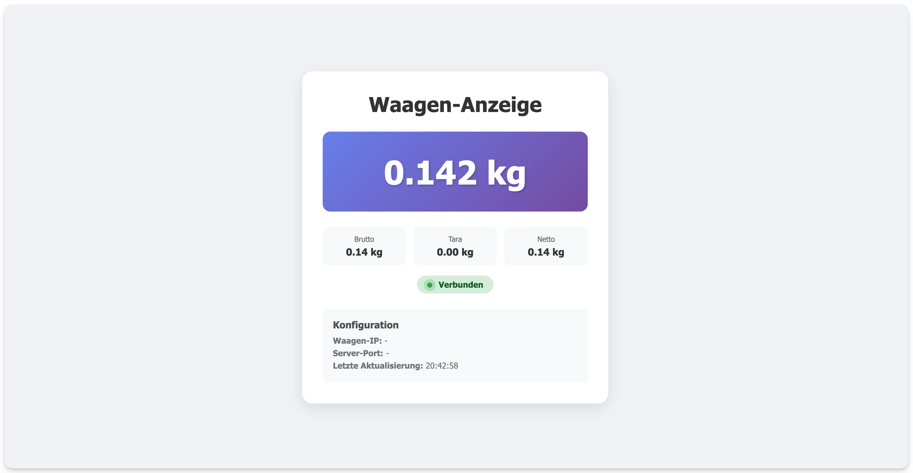

# XTREM Scale Weight Server

[](https://www.npmjs.com/package/@flinkest/xtrem-scale-server)
[](https://opensource.org/licenses/MIT)

A Node.js server that connects to XTREM network scales via UDP and provides real-time weight data through WebSockets and REST API.

## Features

- **Real-time Weight Monitoring**: Live weight updates via WebSockets and Socket.io
- **Web Interface**: Built-in responsive web interface for weight monitoring
- **REST API**: Simple JSON endpoints for weight data retrieval
- **WebSocket API**: Native WebSocket support for easy integration
- **UDP Protocol Support**: Direct communication with XTREM scales
- **Auto-reconnection**: Robust connection handling with automatic retry
- **Cross-platform**: Works on Windows, macOS, and Linux

## Screenshot



*Real-time weight monitoring interface showing current weight, tare, and connection status*

## Installation

### Prerequisites
- Node.js 14.x or higher
- Network access to your XTREM scale

### Option 1: Global Installation (Recommended)
```bash
# Install globally
npm install -g @flinkest/xtrem-scale-server

# Create configuration file
echo "SCALE_IP=your.scale.ip.address" > .env
echo "PORT=3000" >> .env

# Start server
xtrem-scale-server

# Start with debug mode
xtrem-scale-server --debug
```

### Option 2: Local Project Installation
```bash
# Install in your project
npm install @flinkest/xtrem-scale-server

# Create configuration file
echo "SCALE_IP=your.scale.ip.address" > .env
echo "PORT=3000" >> .env

# Edit .env file with your settings
nano .env
```

### Configuration
Create a `.env` file in your current directory:
```bash
SCALE_IP=your.scale.ip.address
PORT=3000
```

Configuration options:
- `SCALE_IP`: IP address of your XTREM scale
- `PORT`: Web server port (default: 3000)

### Start Server

**Global installation:**
```bash
# Normal mode
xtrem-scale-server

# Debug mode (shows all communication)
xtrem-scale-server --debug
```

**Local installation:**
```bash
# Normal mode
npx @flinkest/xtrem-scale-server

# Debug mode
npx @flinkest/xtrem-scale-server --debug
```

The server will start on `http://localhost:3000`

## Usage

### Web Interface
Open your browser and navigate to `http://localhost:3000` to view the real-time weight monitoring interface.

### REST API

#### Get Current Weight
```bash
GET http://localhost:3000/json
```

Response:
```json
{
  "weight": 0.162
}
```

### WebSocket API

Connect to the WebSocket server for real-time weight updates:

```javascript
// Simple WebSocket connection
const ws = new WebSocket('ws://localhost:3001');

ws.onmessage = function(event) {
    const data = JSON.parse(event.data);
    console.log('Weight:', data.display);
};

ws.onopen = () => console.log('Connected to scale');
```

**WebSocket Data Format:**
```json
{
  "display": "0.162 kg",
  "brut": 0.162,
  "tare": 0.000,
  "net": 0.162,
  "unit": "kg",
  "connected": true,
  "timestamp": 1699123456789
}
```


## Socket.io Integration

The web interface uses Socket.io for WebSocket communication:

### Vanilla JavaScript Example
```javascript
// Connect to WebSocket
const socket = io('http://localhost:3000');

// Listen for weight updates
socket.on('weight', (data) => {
  console.log('Weight update:', data);
  // data = {
  //   display: "0.162 kg",
  //   brut: 0.162,
  //   tare: 0.000,
  //   net: 0.162,
  //   unit: "kg",
  //   connected: true
  // }
  
  document.getElementById('weight').textContent = data.display;
  document.getElementById('status').textContent = 
    data.connected ? 'Connected' : 'Disconnected';
});

// Handle connection events
socket.on('connect', () => {
  console.log('Connected to scale server');
});

socket.on('disconnect', () => {
  console.log('Disconnected from scale server');
});

// Handle errors
socket.on('error', (error) => {
  console.error('Scale error:', error);
});
```

### Angular with RxJS Example
```typescript
import { Injectable } from '@angular/core';
import { Observable, BehaviorSubject } from 'rxjs';
import { io, Socket } from 'socket.io-client';

export interface WeightData {
  display: string;
  brut: number;
  tare: number;
  net: number;
  unit: string;
  connected: boolean;
}

@Injectable({
  providedIn: 'root'
})
export class ScaleService {
  private socket: Socket;
  private weightSubject = new BehaviorSubject<WeightData | null>(null);
  private connectionSubject = new BehaviorSubject<boolean>(false);

  constructor() {
    this.socket = io('http://localhost:3000');
    this.setupSocketListeners();
  }

  private setupSocketListeners(): void {
    this.socket.on('connect', () => {
      this.connectionSubject.next(true);
      console.log('Connected to scale server');
    });

    this.socket.on('disconnect', () => {
      this.connectionSubject.next(false);
      console.log('Disconnected from scale server');
    });

    this.socket.on('weight', (data: WeightData) => {
      this.weightSubject.next(data);
    });

    this.socket.on('error', (error: any) => {
      console.error('Scale error:', error);
    });
  }

  // Observables for components to subscribe to
  get weight$(): Observable<WeightData | null> {
    return this.weightSubject.asObservable();
  }

  get connection$(): Observable<boolean> {
    return this.connectionSubject.asObservable();
  }

  // Get current values synchronously
  get currentWeight(): WeightData | null {
    return this.weightSubject.value;
  }

  get isConnected(): boolean {
    return this.connectionSubject.value;
  }

  disconnect(): void {
    this.socket.disconnect();
  }
}
```

### Angular Component Example
```typescript
import { Component, OnInit, OnDestroy } from '@angular/core';
import { Subject } from 'rxjs';
import { takeUntil } from 'rxjs/operators';
import { ScaleService, WeightData } from './scale.service';

@Component({
  selector: 'app-weight-monitor',
  template: `
    <div class="weight-monitor">
      <h2>Scale Weight Monitor</h2>
      
      <div class="status" [class.connected]="isConnected" [class.disconnected]="!isConnected">
        {{ isConnected ? 'Connected' : 'Disconnected' }}
      </div>
      
      <div class="weight-display">
        <span class="weight">{{ currentWeight?.display || 'No data' }}</span>
      </div>
      
      <div class="weight-details" *ngIf="currentWeight">
        <div>Brut: {{ currentWeight.brut }} {{ currentWeight.unit }}</div>
        <div>Tare: {{ currentWeight.tare }} {{ currentWeight.unit }}</div>
        <div>Net: {{ currentWeight.net }} {{ currentWeight.unit }}</div>
      </div>
    </div>
  `,
  styleUrls: ['./weight-monitor.component.css']
})
export class WeightMonitorComponent implements OnInit, OnDestroy {
  currentWeight: WeightData | null = null;
  isConnected: boolean = false;
  private destroy$ = new Subject<void>();

  constructor(private scaleService: ScaleService) {}

  ngOnInit(): void {
    // Subscribe to weight updates
    this.scaleService.weight$
      .pipe(takeUntil(this.destroy$))
      .subscribe(weight => {
        this.currentWeight = weight;
      });

    // Subscribe to connection status
    this.scaleService.connection$
      .pipe(takeUntil(this.destroy$))
      .subscribe(connected => {
        this.isConnected = connected;
      });
  }

  ngOnDestroy(): void {
    this.destroy$.next();
    this.destroy$.complete();
  }
}
```

## Network Configuration

### Scale Requirements
- **UDP Send Port**: 4444 (to scale)
- **UDP Receive Port**: 5555 (from scale)

### Server Ports
- **Web Interface**: http://localhost:3000
- **WebSocket API**: ws://localhost:3001
- **Socket.io**: ws://localhost:3000/socket.io/

### Connection Process
1. Connect your computer to the XTREM scale's network
2. Configure the scale IP in your `.env` file
3. Start the server with `npm start`
4. The server will send a START command to enable streaming mode
5. Weight data will be received automatically

## Protocol Details

The server communicates with XTREM scales using a proprietary UDP protocol in streaming mode:
- **Communication Mode**: Streaming (continuous data)
- **START Command**: `\x0200FFE10110000\x03\r\n` (enables streaming)
- **STOP Command**: `\x0200FFE10100000\x03\r\n` (disables streaming)
- **Response Format**: `0100r01071AW   [weight]kgT   [tare]kgS[status]`
- **Data Rate**: Scale sends updates automatically when weight changes

## Troubleshooting

### Common Issues

**No weight data received:**
- Verify you're connected to the scale's network
- Check that the scale is powered on and responding
- Ensure no firewall is blocking UDP ports 4444/5555
- Verify the scale IP address in your `.env` file

**Scale disconnects frequently:**
- The scale may be overloaded with requests
- Check network stability
- Restart the scale if necessary

**Parse errors:**
- Verify the scale firmware supports the expected protocol
- Check console logs for detailed error messages

## Development

### Development Setup
```bash
# Clone the repository
git clone https://github.com/flinkest/xtrem-scale-weight-server.git
cd xtrem-scale-weight-server

# Install dependencies
npm install

# Copy configuration
cp .env.example .env

# Edit configuration
nano .env

# Start in development mode
npm run dev
```

### Project Structure
```
├── server.js          # Main server application
├── public/
│   └── index.html     # Web interface
├── .env.example       # Example configuration
├── package.json       # Dependencies and scripts
├── README.md          # This file
└── CLAUDE.md          # Technical documentation
```

### Contributing
1. Fork the repository
2. Create a feature branch
3. Make your changes
4. Test thoroughly with actual XTREM scale
5. Submit a pull request

## License

MIT License - see LICENSE file for details

## Support

For support and questions:
- Check the troubleshooting section above
- Review `CLAUDE.md` for technical implementation details
- Create an issue in the project repository

---

**Note**: This software is designed specifically for XTREM network scales. Compatibility with other scale brands is not guaranteed.
